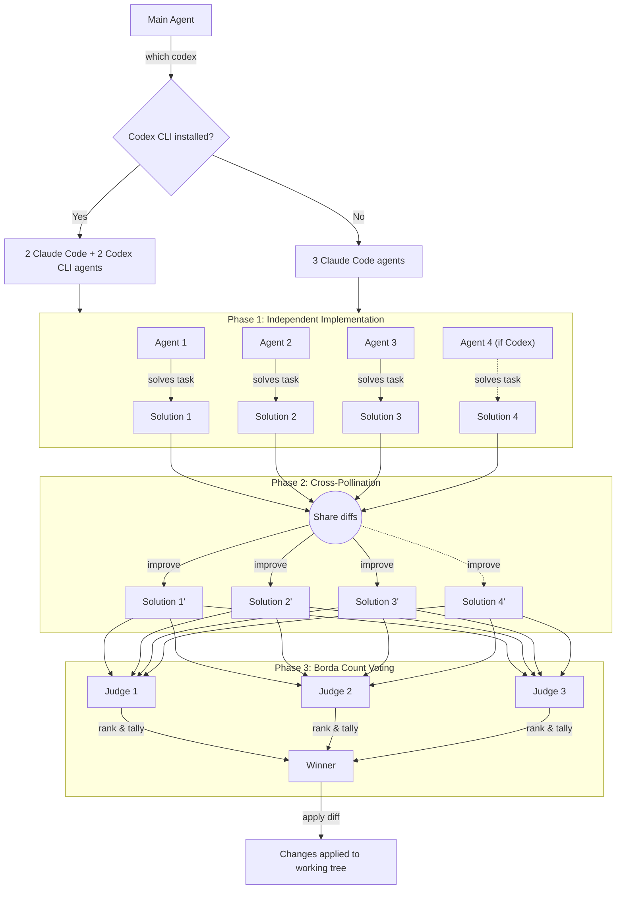

# 🏇 Horse Race

**One prompt. Multiple agents. Best solution wins.**

Why settle for one AI-generated solution when you can have several compete for the best one? Horse Race spawns multiple agents in parallel — Claude Code subagents and [OpenAI Codex CLI](https://github.com/openai/codex) agents when available — lets them learn from each other, and picks the winner through a blind vote. All automatically.

## 📦 Installation

```bash
npx skills install qiao/horse-race
```

## 🚀 Usage

Once installed, trigger the skill with the slash command:

```
/horse-race implement a linked list
```

Or just mention it naturally:

- "horse race this task"
- "race: implement a linked list"
- "compete on solving this bug"

Override defaults with e.g. "horse race this with 5 agents and 3 rounds".

## 🤔 Why Horse Race?

LLMs are non-deterministic. The same prompt can produce wildly different solutions. Some will be elegant, some will miss edge cases, some will be over-engineered. Instead of rolling the dice once and hoping for the best, Horse Race:

- 🔍 **Explores the solution space** by generating multiple independent approaches in parallel
- 🌱 **Cross-pollinates the best ideas** so each agent can learn from the others' strengths
- 🎭 **Eliminates bias** through blind judging. Judges never know which agent wrote which solution
- 🗳️ **Picks the winner fairly** using Borda count, a ranked-choice voting method that's hard to game

The result? Better code than any single generation, consistently. 💪

## ⚙️ How It Works



### 🐎 Phase 1: Independent Implementation

Multiple agents are spawned in parallel, each in its own isolated git worktree. If [OpenAI Codex CLI](https://github.com/openai/codex) is installed, the race uses 2 Claude Code subagents and 2 Codex CLI agents (4 total); otherwise it falls back to 3 Claude Code subagents. Mixing model providers adds genuine diversity to the solution space — different models have different strengths, blind spots, and coding styles. Every agent independently solves the same task with no knowledge of what the others are doing.

### 🔄 Phase 2: Improvement Rounds

Here's where it gets interesting. After the initial implementations, each agent receives the diffs from **all** other agents. They study what others did better, identify clever approaches or edge cases they missed, and incorporate the best ideas into their own solution while maintaining coherence. This cross-pollination runs for multiple rounds (default: 1), with agents sharing updated diffs each time. Solutions converge toward higher quality while retaining their distinct approaches.

Think of it like a writers' room. Everyone drafts independently, then passes their work around the table for feedback and inspiration.

### 🏆 Phase 3: Borda Count Voting

Three fresh judge agents, with no connection to any solution, independently evaluate and rank all final solutions on correctness, code quality, edge case handling, simplicity, and performance. Scores are tallied using [Borda count](https://en.wikipedia.org/wiki/Borda_count): with N solutions, 1st place gets N-1 points, 2nd gets N-2, and so on. The solution with the highest total score wins. If there's a tie, a 4th tiebreak judge steps in.

The winning diff is applied to your working tree (but not committed), so you can review the changes before committing.

## 📋 Defaults

| Parameter | Default |
|---|---|
| Implementation agents | 2 Claude + 2 Codex (with Codex CLI), or 3 Claude (without) |
| Improvement rounds | 1 |
| Voting judges | 3 |
