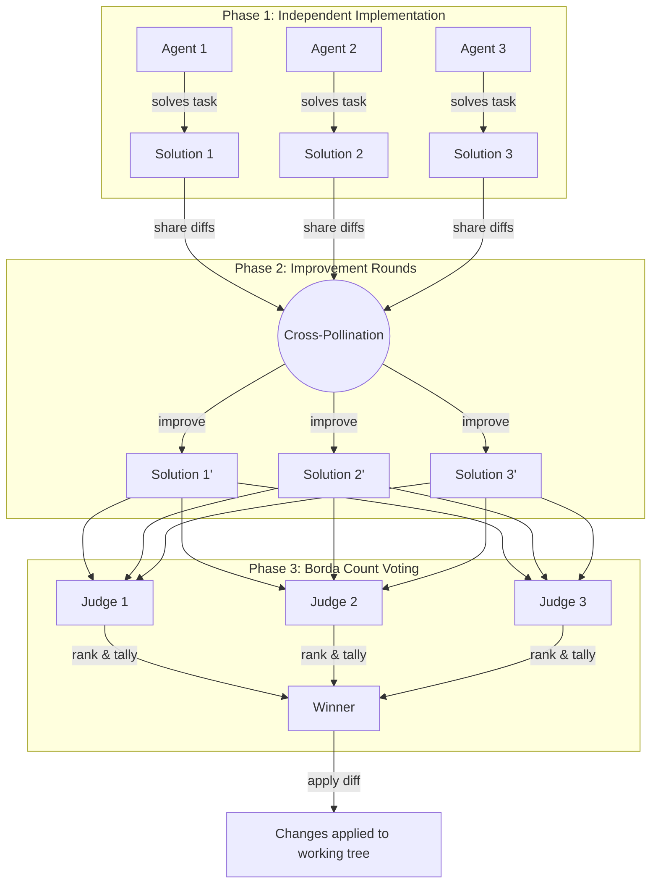

# Horse Race

Competitive multi-agent problem solving for Claude Code. Spawns multiple Claude Code sub-agents in parallel git worktrees to independently solve the same programming task, cross-pollinates their solutions through improvement rounds, and selects the best solution through Borda count consensus voting.

## Installation

```bash
npx skills install qiao/horse-race-skill
```

## Usage

Once installed, trigger the skill with the slash command:

```
/horse-race implement a linked list
```

Or just mention it naturally:

- "horse race this task"
- "race: implement a linked list"
- "compete on solving this bug"

Override defaults with e.g. "horse race this with 5 agents and 3 rounds".

## How It Works



### Phase 1: Independent Implementation

Multiple agents are spawned in parallel, each in its own isolated git worktree. Every agent independently solves the same task with no knowledge of what the others are doing. This produces diverse approaches — different algorithms, code structures, and edge case handling — giving the process a wide solution space to work with.

### Phase 2: Improvement Rounds

After the initial implementations, each agent receives the diffs from **all** other agents. They study what others did better, identify clever approaches or edge cases they missed, and incorporate the best ideas into their own solution while maintaining coherence. This cross-pollination runs for multiple rounds (default: 2), with agents sharing updated diffs each time. Solutions converge toward higher quality while retaining their distinct approaches.

### Phase 3: Borda Count Voting

Three fresh judge agents — with no connection to any solution — independently evaluate and rank all final solutions on correctness, code quality, edge case handling, simplicity, and performance. Scores are tallied using [Borda count](https://en.wikipedia.org/wiki/Borda_count): with N solutions, 1st place gets N−1 points, 2nd gets N−2, and so on. The solution with the highest total score wins. If there's a tie, a 4th independent tiebreak judge decides the winner.

The winning diff is applied to your working tree (but not committed), so you can review the changes before committing.

## Defaults

| Parameter | Default |
|---|---|
| Implementation agents | 3 |
| Improvement rounds | 2 |
| Voting judges | 3 |
